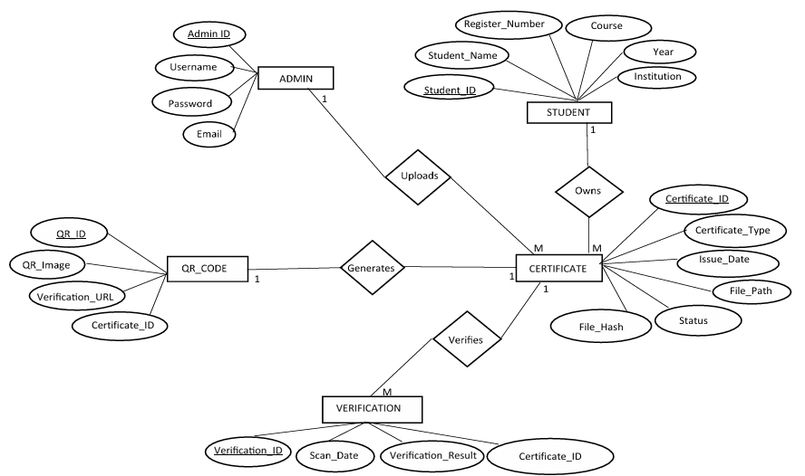
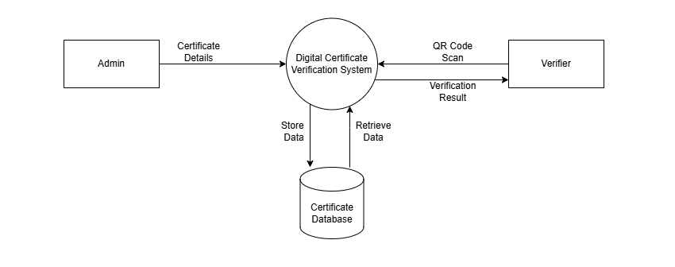
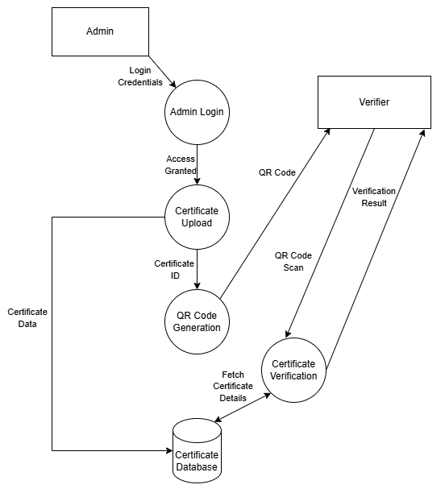
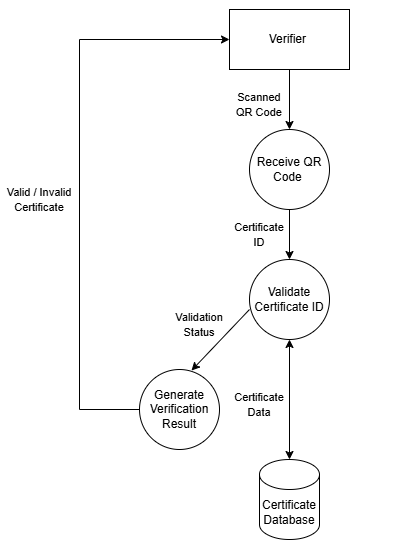
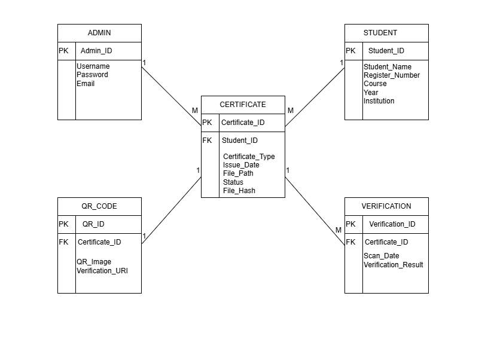
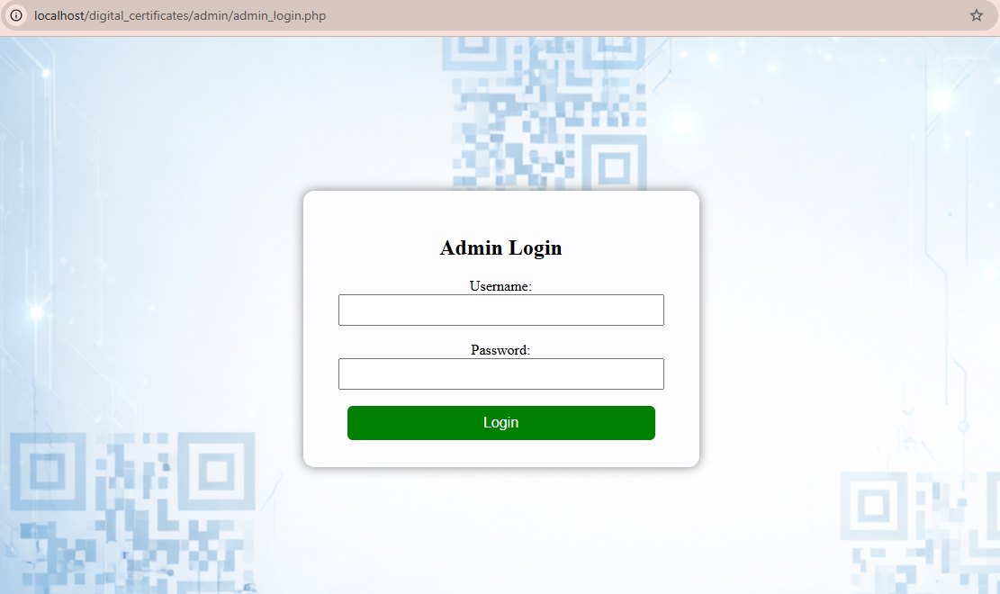
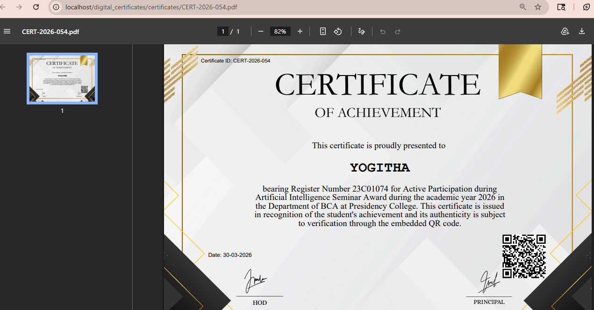
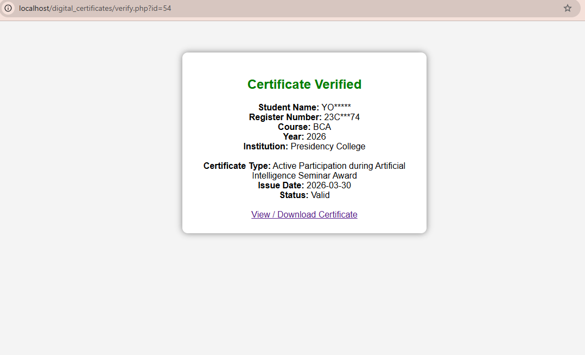
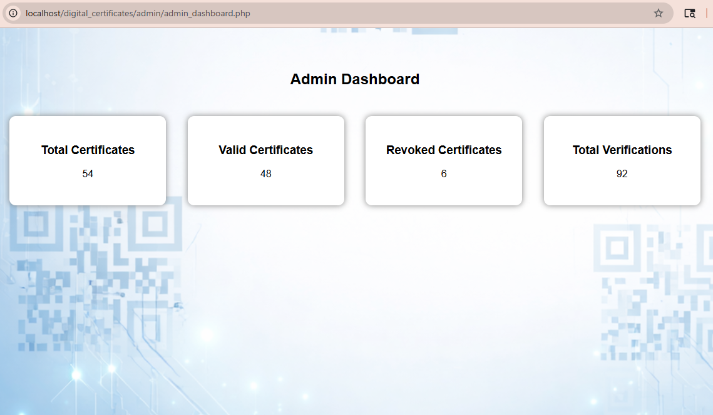

# QR Code Based Digital Certificate Verification System to Prevent Forgery.

## Project Overview

The QR Code Based Digital Certificate Verification System is a web-based application developed to prevent certificate forgery and ensure secure verification of academic and professional certificates.

The system generates digital certificates embedded with QR codes and unique hashes. Users can verify certificate authenticity by scanning the QR code, while administrators can generate, manage, revoke, and monitor certificates through a centralized dashboard.

The project also supports external certificate uploads, tampered certificate detection, verification logging, and secure certificate validation.

---

## Problem Statement

Traditional paper-based certificates are vulnerable to duplication, modification, and forgery. Manual verification is time-consuming and often unreliable.

This project addresses these issues by providing a secure QR-code-based certificate verification system that enables instant validation and detection of altered certificates.

---

## Project Objectives

- Generate digital certificates with unique QR codes.
- Verify certificate authenticity through QR scanning.
- Prevent certificate forgery and misuse.
- Detect tampered or modified certificates.
- Maintain verification logs for auditing purposes.
- Provide secure certificate management for institutions.
- Enable external certificate upload and validation.

---

## Key Features

- Administrator Login System
- Certificate Generation
- QR Code Generation
- Certificate Verification
- External Certificate Upload
- Verification Logs
- Certificate Revocation
- Tampered Certificate Detection
- Invalid Certificate Detection
- Secure Database Management

---

## Project Structure

```text
digital-certificate-verification-system

├── diagrams/
│   ├── er_diagram.png
│   ├── dfd_level0.png
│   ├── dfd_level1.png
│   ├── dfd_level2.png
│   └── database_schema.png
├── digital_certificates/
│   ├── admin/
│   ├── certificates/
│   ├── qrcodes/
│   └── templates/
├── screenshots/
├── .gitattributes
├── README.md
├── clean_database.sql
└── project_documentation.pdf
```
The complete source code implementation can be found in the [digital_certificates](./digital_certificates/) directory.

---

## Installation & Setup

1. Install XAMPP and start Apache and MySQL services.

2. Clone or download this repository.

3. Copy the `digital_certificates` folder to the XAMPP `htdocs` directory.

4. Create a new MySQL database using phpMyAdmin.

5. Import the `clean_database.sql` file to set up the required database tables.

6. Configure the database connection settings in the project files if necessary.

7. Open the application in a web browser: http://localhost/digital_certificates

8. Log in as an administrator to generate, manage, and verify digital certificates.

9. Use the verification module to validate certificates through QR code scanning and hash-based integrity checks.

---

## System Workflow

1. Admin logs in to the system.
2. Student details are entered.
3. Certificate information is processed.
4. QR code and unique hash are generated.
5. Digital certificate is created.
6. Certificate is stored in the database.
7. Certificate is issued to the student.
8. Student can access and verify certificates.
9. User scans the QR code for verification.
10. Certificate authenticity is validated.
11. Verification result is displayed.

---

## System Design

The following diagrams illustrate the data flow, entity relationships, and database structure of the Digital Certificate Verification System.

### Entity Relationship(ER) Diagram

<p align="center">
  
</p>

### Data Flow Diagram (Level 0)

<p align="center">
  
</p>

### Data Flow Diagram (Level 1)

<p align="center">
  
</p>

### Data Flow Diagram (Level 2)

<p align="center">
  
</p>

### Database Schema Diagram

<p align="center">
  
</p>

---

## System Modules

### 1. Admin Module
The administrator can securely log in to the system and access all certificate management functionalities.

### 2. Certificate Generation Module
Allows administrators to generate digital certificates containing student details and QR codes.

### 3. QR Code Verification Module
Enables instant certificate verification through QR code scanning.

### 4. External Certificate Upload Module
Allows external certificates to be uploaded and verified within the system.

### 5. Verification Logs Module
Stores verification history and maintains audit records.

### 6. Certificate Revocation Module
Allows invalid or withdrawn certificates to be revoked from the system.

### 7. Tampered Certificate Detection Module
Detects modifications made to certificates using file hash comparison.

---

## Security Features

- QR Code Based Verification
- File Hash Validation
- Tampered Certificate Detection
- Certificate Revocation
- Verification Logging
- Secure Administrator Access

---

## Tech Stack

| Category | Technology |
|-----------|------------|
| Frontend | HTML, CSS, JavaScript |
| Backend | PHP |
| Database | MySQL |
| Environment | XAMPP |
| Libraries | QR Code Generator, FPDF, FPDI |

---

## Database Design

The system uses MySQL as the backend database.

### Tables Used

### ADMIN
Stores administrator login information.

### STUDENT
Stores student details such as name, register number, course, year, and institution.

### CERTIFICATE
Stores certificate information including issue date, certificate type, status, and file hash.

### QR_CODE
Stores QR code images and verification URLs linked to certificates.

### VERIFICATION
Stores verification logs and verification results.

### INSTITUTION
Stores institution information for certificate generation and validation.

---

## Screenshots

Below are some screenshots demonstrating the system functionality.

Additional implementation screenshots are available in the <a href="./screenshots">screenshots</a> directory.

<p align="center">
  
  
  
</p>

<p align="center">
  
  
  
</p>

---

## Project Documentation

Complete Project Report:[Project Documentation](./project_documentation.pdf)

---

## Future Enhancements

- Mobile Application Integration
- Blockchain-Based Certificate Verification
- Multi-Institution Support
- Cloud Deployment
- Advanced Analytics Dashboard

---

## Conclusion

The QR Code Based Digital Certificate Verification System provides a secure and efficient solution for certificate generation and verification. By combining QR code technology, file hash validation, and verification logging, the system helps institutions reduce certificate forgery and improve trust in digital credentials.
